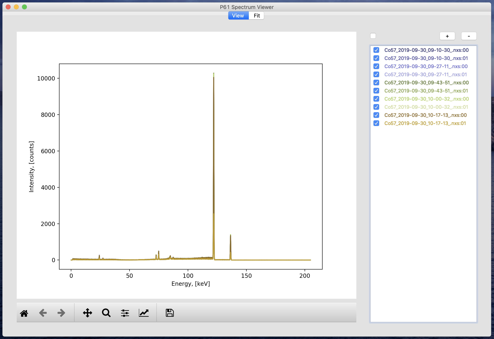

# P61B Viewer
This software is for viewing and basic analysis of the data from HZG 
beamline P61B at PETRAIII located at DESY, Hamburg.

P61B is an energy-dispersive diffraction beamline intended mainly for residual
stress analysis. The detectors produce files in 
[NeXus format](https://www.nexusformat.org) which is a sub-standard of HDF5 
developed for muon, X-ray, and neutron science. 

# Release
At the moment the project is in pre-alpha release state. Release is scheduled for December 1st 2019.
Alpha features:
* Import / viewing of beamline-specific .nxs files 
* Data fit with a function built from 
[lmfit models](https://lmfit.github.io/lmfit-py/builtin_models.html)
* Downloadable binaries for Windows 10, Mac OS X, and Linux