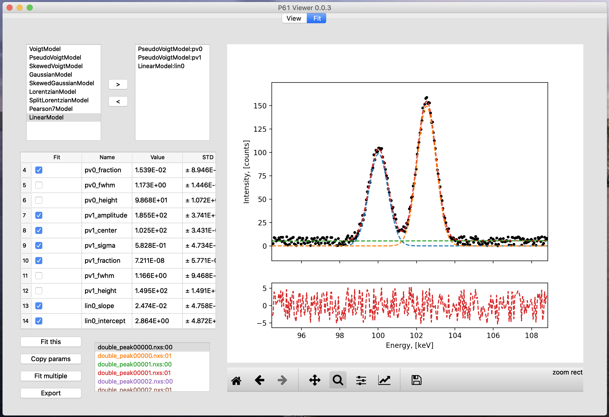

# P61 Viewer
This software is for viewing and basic analysis of the data from HZG 
beamline P61A at PETRAIII located at DESY, Hamburg. P61A is an energy-dispersive diffraction beamline intended mainly for residual
stress analysis. 

 

P61 Viewer is currently in alpha release. 
You can find the latest downloadable binaries on the [release page](https://github.com/glebdovzhenko/P61Viewer/releases).
If you wish to install P61Viewer from the source code, the instructions are [here](https://glebdovzhenko.github.io/P61Viewer/installation/index.html). 
You can find a quick user guide [here](https://glebdovzhenko.github.io/P61Viewer/userguide/index.html) and the developer documentation 
[here](https://glebdovzhenko.github.io/P61Viewer/developer/index.html) (documentation is mostly under construction).