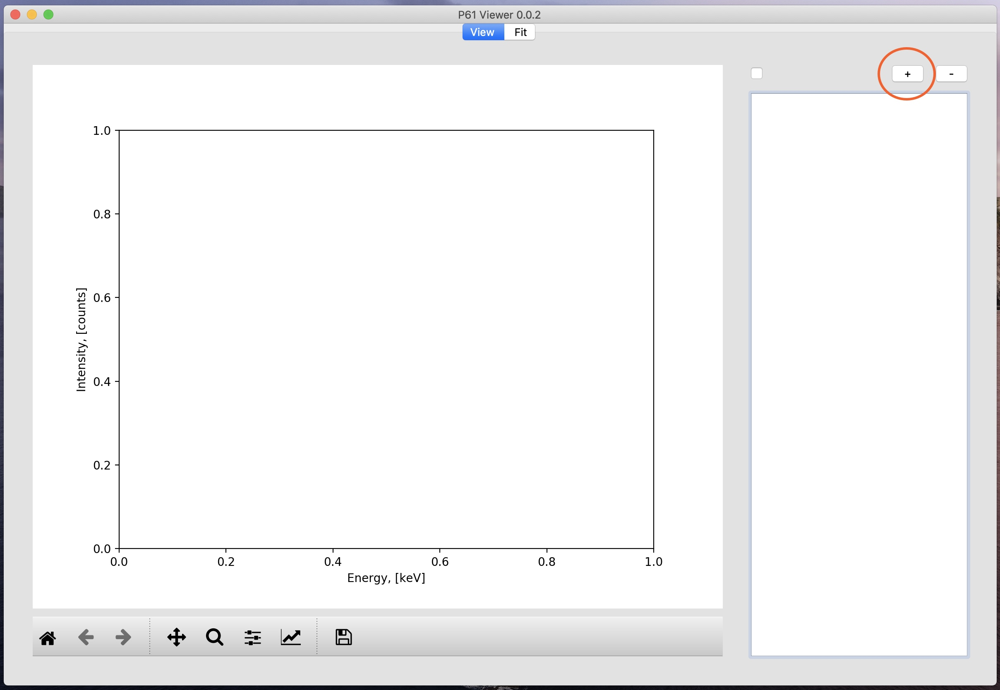
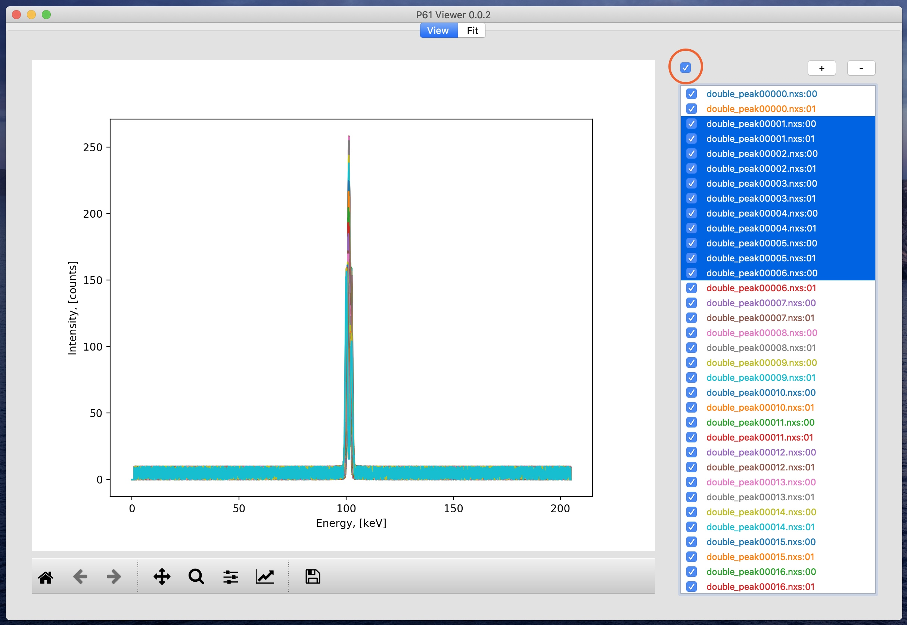
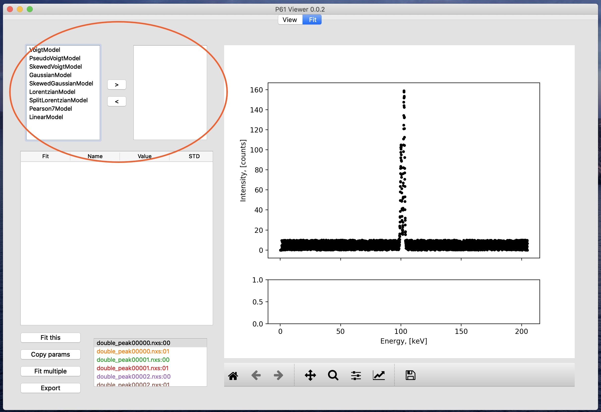
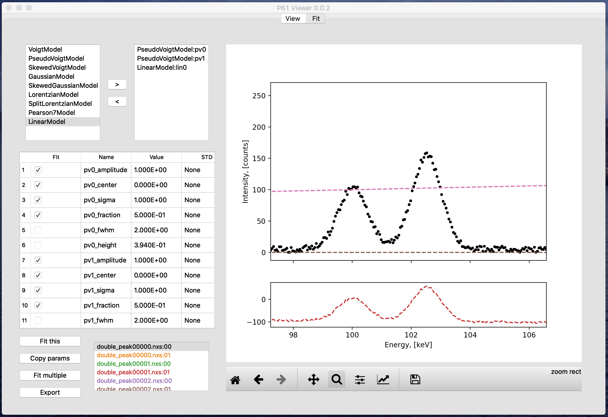

User guide (updated for version 0.0.2)
======================================

Test files
----------

You can get the test files if you pull or download the repository. The files are in the
:code:`P61Viewer/test_files/generated` folder.

Open and view .nxs spectra
--------------------------

In P61 Viewer you can view and compare multiple :code:`.nxs` files at once. To do that click the "+" button:

Once the files are open, you can show or hide their data from the plot by clicking the checkboxes next to their names.
To change visibility of multiple files at once, select them on the list and click the checkbox above.

To close the files, select them on the list and click the "-" button.

Note, that each :code:`.nxs` file contains two datasets coming from channels (detectors) 0 and 1.
Also note, that if you try to open a dataset that is already open, the program will do nothing.

Plot controls
-------------

Plot controls are standard for `matplotlib <https://matplotlib.org>`_ library. To autoscale, move, or magnify the plot you
have to first click the appropriate buttons below:

Sequential fit with an arbitrary model
--------------------------------------

First make sure that all of the datasets you would like to fit have checked boxes next to them.
Then you need to switch to the "Fit" tab by clicking it:

Now you need to select the fit area by scaling the plot (only data within the plot x range will be taken for the fit).
In this case we want to focus on the two peaks in the middle of the spectrum.

.. image:: 06-area.jpg

Now let us have a look at the interface. First we have the fit model builder:

On the left side of the model builder you have the list of all available models, and on the right the models,
sum of which will be used for the fit.
To add a model to the list on the right, select it in the left list and click the right-pointing arrow button.
To remove a model from the list on the right, select it in the right list and click the left-pointing arrow button.

For this dataset we are going to use two pseudo-Voigt functions and a linear function. After adding them to the model
the result should look like this:

Note that all models have a shortened unique name after a colon: :code:`PseudoVoigtModel:pv0`,
:code:`PseudoVoigtModel:pv1`, :code:`LinearModel:lin0`. This short name is used as a prefix in model parameter names,
so that all parameter names in the fit are unique.
For instance, parameter name :code:`pv0_amplitude` is the amplitude of the pseudo-Voigt model :code:`pv0`.
A description of all models, their parameters and their meaning can be found
`here <https://lmfit.github.io/lmfit-py/builtin_models.html>`_.